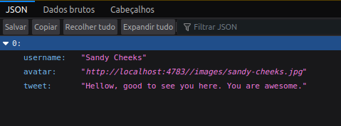

<p align="center">
  <a href="https://raferdev.github.io/driveneats/">
 </a>
</p>

<h3 align="center">Tweteroo</h3>

<div align="center">

[]()
[](https://github.com//raferdev/globo.com/issues)
[](https://github.com/raferdev/globo.com/pulls)
[](/LICENSE)

</div>

---



<p align="center"> This is a simply backend content build using NodeJS, Express, witch was my first experience working on back-end. I emproved this project with this readme, docker and docker-compose because i feel this project is the start point understanding the power on my hands.
</p>

## 📝 Table of Contents

- [About](#about)
- [Getting Started](#getting_started)
- [Usage](#usage)
- [Built Using](#built_using)
- [Authors](#authors)

## 🧐 About <a name = "about"></a>

This project is one POC of how backend is usefull to frontend. It return and receive objects to emulate login and tweets. And that is it, simple but the first.
## 🏁 Getting Started <a name = "getting_started"></a>

You can clone the project and start on your local host.

Clone

 ```
 git clone https://github.com/raferdev/driveneats
 ```

## 🎈 Usage <a name="usage"></a>

Go to project path 
```
cd driveneats
```
Create env file: Open a note editor or other editor do you prefeer, create this variables like below and save with name '.env'
```
PORT=5000
HTTP=http://localhost:5000/
```
You can change the PORT and HTTP value

Start docker container using 
```
docker-compose up
```
You will see one message like 'Hello i'm running on port = (port on env file)' on the terminal. And you can make a get request on 'http:localhost:(port)/tweets' and receive one object like image you saw on the initial part of this readme.

GET /tweets - return array of objects

```
[
  {
  username:"Sandy Cheeks",
  avatar:"http://localhost:4783//images/sandy-cheeks.jpg"
  tweet:"Hellow, good to see you here. You are awesome.},
]
```

POST /tweets - object format proposal below (but backend dont verify the object format)
```
  {
  username:"",
  avatar:""
  tweet: ""
  }
```
POST /login - object format proposal below (but backend dont verify the object format)
```
{
  username:"",
  password:""
}
```
Will return 'OK'

ANNNDD that is it... I said was my first project.

## ⛏️ Built Using <a name = "built_using"></a>

- [NodeJS](https://nodejs.org/en/docs/) - Backend Language
- [Express](https://expressjs.com/pt-br/) - Node Framework
- [Docker](https://www.docker.com/) - Container Technology

## ✍️ Authors <a name = "authors"></a>

- [@raferdev](https://github.com/raferdev)
